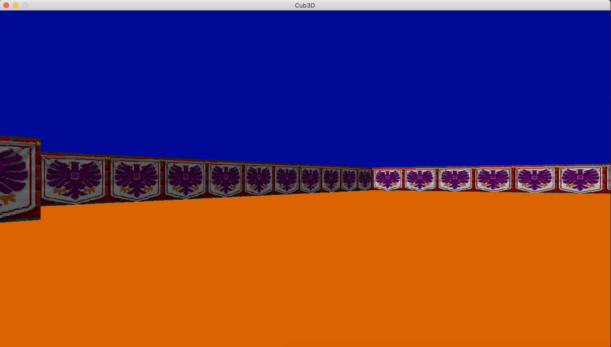
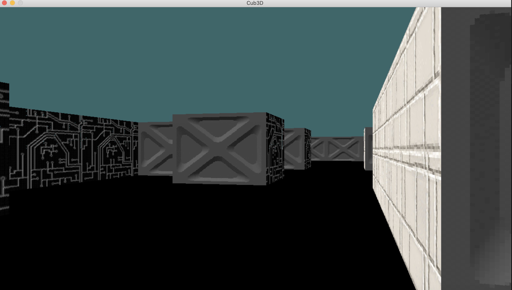

# cub3D Project README

Welcome to cub3D, your first RayCaster with miniLibX!

## Introduction
cub3D is a project inspired by the iconic Wolfenstein 3D game, designed to introduce you to the world of ray-casting. In this project, we are creating a dynamic 3D graphical representation of a maze from a first-person perspective using the principles of ray-casting.

## Version
Current version: 10

## Table of Contents
1. [Description](#description)
2. [Project Structure](#project-structure)
3. [How to Run](#how-to-run)
4. [Examples](#examples)
4. [Features](#features)
5. [Bonus Features](#bonus-features)
6. [Examples](#examples)
7. [Acknowledgments](#acknowledgments)
8. [Resources](#resources)
9. [Contacts](#contacts)
10. [Section](#section)

## Description
In cub3D, your goal is to create a realistic 3D view inside a maze. You'll use the miniLibX library to handle graphics and create the maze environment. The project emphasizes C programming skills, algorithm implementation, and graphical design.

## Project Structure
- **src/**: Contains the source code files for the project. There is the mandatory_src for the mandatory part of the project and bonus_src for the bonus part of the project.
- **includes/**: Contains header files.
- **libft/**: My own library file with the main functions I have reimplemented in c.
- **Makefile**: Compiles the project with specified flags.
- **map.cub**: Example scene description file.

## How to Run
1. This project can be runned in MacOs or Linux platforms, or use docker containers to run it on linux.
2. Clone the repository to your local machine.

	git clone --recursive \<url\>

3. Navigate to the project directory.
4. Run `make` to compile the project.
5. Execute the program with `./cub3D maps/mand_maps/map.cub` or  `./cub3D_bonus maps/bonus_maps/map.cub`

## Examples

Here is a video of a small gameplay from the bonus part

And here you can see some examples from the mandatory part with different textures

## Features
- Realistic 3D graphical representation of a maze.
- Smooth window management.
- Display of different wall textures based on orientation.
- Customizable floor and ceiling colors.
- Player movement using arrow keys and WASD.
- Clean program exit on ESC key or window close.

## Bonus Features
If you've completed all mandatory requirements perfectly, you can explore bonus features such as:
- Wall collisions.
- Minimap system.
- Doors that can open and close.
- Animated sprites.
- Mouse-based point of view rotation.

## Examples
Check out the examples provided in the project documentation for visual representations of the game environment and bonus features in the [subject](subject.pdf).

## Acknowledgments
This project was a team project and I was happy to work with [Ivan Petruni](https://github.com/vanichx/vanichx) my teammate which also did a splendid job on the minimap.

## Resources 

Kind of Raycasting Bible: Raycasting Tutorial https://lodev.org/cgtutor/raycasting.html

How Wolfenstein 3D Raycasting Works - Pseudo 3D: Video Tutorial https://www.youtube.com/watch?v=8XnQq28TRZY

Raycasting HTML5 with JavaScript (Part 1) - Cloning Wolfenstein 3D: Video Tutorial https://youtu.be/8tYKQi_cRV0 

Raycast Theory: Video Tutorial https://www.youtube.com/watch?v=NbSee-XM7WA

## Contacts

For any inquiries or further discussion, feel free to connect with me on [LinkedIn](https://www.linkedin.com/in/erik-seferi-393438202/). You can also reach me via email at `rk.seferi[at]gmail[dot]com`.

## Lincese

This project is licensed under the terms of the MIT license. See the [LICENSE](LICENSE) file for details.